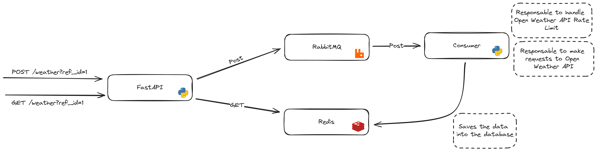

# proj-open-weather-api
This project is a microservice designed to collect weather data from Open Weather API. The project was made with
Docker and Docker Compose to make the environment simple, easy to use and deploy. 


- [Technologies](#technologies)
- [Prerequisites](#prerequisites)
- [Infrastructure](#infrastructure)
- [How to's](#how-to's)
    - [How to setup the environment](#how-to-setup-the-environment)
    - [How to run the application](#how-to-run-the-application)
    - [How to run the tests](#how-to-run-the-tests)
- [Specifications](#specifications)
    - [Containers](#containers)
    - [API Endpoints](#api-endpoints)
        - [POST /weather](#post-weather)
        - [GET /weather](#get-weather)

## Technologies
- Python3
- FastAPI
- RabbitMQ
- Redis

You can check the architecture of the project below to see how the techologies are used and communicate with each other.

## Prerequisites
- Docker
- Docker Compose
- To run some scripts you will need to install the `build-essentials` package.

## Infrastructure



## How to's

### How to setup the environment
In the all `docker-compose` files you will find the `OPEN_WEATHER_API_KEY` environment variable, change it to your API key.

**NOTE:** To run the dev environment and tests the variable must be set.

**NOTE 2:** You can get your API key from [OpenWeather](https://home.openweathermap.org/users/sign_up)

### How to run the application
You have to run the application with the following commands:
1. If you are running for the first time:
```bash
docker compose up --build
```
Or:
```bash
make build
```

2. Running the application:
```bash
docker compose up
```
Or:
```bash
make run
```

### How to run the tests
You have to run the tests with the following commands:
1. Run all the tests:
```bash
docker compose -f docker-compose.ci.yaml up
```
Or:
```bash
make test
```
2. Run specific test:
```bash
docker compose -f docker-compose.ci.yaml up --exit-code-from api api
docker compose -f docker-compose.ci.yaml up --exit-code-from consumer consumer
```
Or:
```bash
make test-api
make test-consumer
```

## Specifications

### Containers
The project has the following containers and running on the following ports:
| Container | Image | Port |
| --- | --- | --- |
| api | `proj-open-weather-api/api` | 8000 |
| consumer | `proj-open-weather-api/consumer` | N/A |
| rabbitmq | rabbitmq | 5672 |
| redis | redis | 6379 |

### API Endpoints
#### **POST /weather**
- **Description:** Gets the user `ref_id` and acts as a RabbitMQ producerto send the `ref_id`, all the 168 cities ids to the consumer to process.
- **Parameters:** 
    ```json
    {
        "ref_id": "int"
    }
    ```
- **Excpetions:**

    **Status: 400**
    ```json
    {
        "detail": "User ref_id already exists. Please try again with a new ref_id."
    }
    ```
    **Status: 500**
    ```json
    {
        "detail": "Unexpected error: <error message>"
    }
    ```
- **Returns:**
    ```json
    {
        "message": "Task created",
        "ref_id": "int"
    }
    ```

#### **GET /weather**
- **Description:** With the user `ref_id` returns the precentage of the POST progress (i.e, the number of cities processed) until the current moment.
- **Parameters:** 
    ```json
    {
        "ref_id": "int"
    }
    ```
- **Excpetions:**
    **Status: 404**
    ```json
    {
        "detail": "User ref_id not found! Please try again with a valid ref_id."
    }
    ```
    **Status: 500**
    ```json
    {
        "detail": "Unexpected error: <error message>"
    }
    ```
- **Returns:**
    ```json
    {
        "id": "int",
        "progress": "string"
    }
    ```

